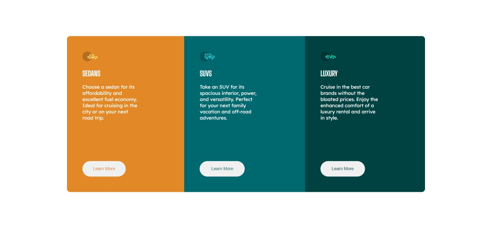

# Frontend Mentor - 3-column preview card component solution

This is a solution to the [3-column preview card component challenge on Frontend Mentor](https://www.frontendmentor.io/challenges/3column-preview-card-component-pH92eAR2-). Frontend Mentor challenges help you improve your coding skills by building realistic projects. 

## Table of contents

- [Overview](#overview)
  - [The challenge](#the-challenge)
  - [Screenshot](#screenshot)
  - [Links](#links)
- [My process](#my-process)
  - [Built with](#built-with)
  - [Continued development](#continued-development)
- [Author](#author)
- [Acknowledgments](#acknowledgments)

## Overview

### The challenge

Users should be able to:

- View the optimal layout depending on their device's screen size
- See hover states for interactive elements

### Screenshot

### Links

- Solution URL: <https://www.frontendmentor.io/solutions/responsive-mobile-first-solution-using-flexbox-v_kN9jk5Om>
- Live Site URL: <https://beepbot99.github.io/3-column-preview-card-component-main/>

## My process

### Built with

- HTML5
- CSS3
- Flexbox
- Hover Selectors
- Reusable Classes
- CSS Grid
- Mobile-first workflow

### Continued development

One thing I want to work on is getting the widths and paddings more exact. I also want to stop using IDs and more reusable classes.

## Author

- Github - [BeepBot99](https://github.com/BeepBot99)
- Frontend Mentor - [@BeepBot99](https://www.frontendmentor.io/profile/BeepBot99)

## Acknowledgments

I would like to thank [Codecademy](https://codecademy.com) for teaching me HTML, CSS and how to use flexboxes really nicely.